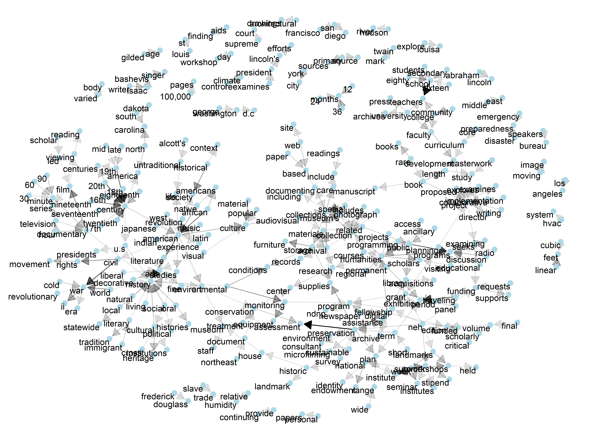

The data is obtained from th [NEH webpage](https://securegrants.neh.gov/publicquery/).

```{r}
library(tidyverse)
library(readxl)
library(lubridate)
library(stringr)
library(tidytext)
library(igraph)
library(ggraph)
library(rgdal)
library(rgeos)
library(tmap)
```
Read in data in files and bind them to one dataframe. 

```{r}
data_files <- paste0("neh-data/", list.files("neh-data")) # list data files

data_file_list <- map(data_files, read_excel) # read in all data files
grant_data <- data_file_list %>% map_df(bind_rows) # merge the list of df-s into one dataframe

```
Some data cleaning and filtering. Only grants awarded to U.S institutions will be analyzed.

```{r}
grant_data <- filter(grant_data, !(ApplicationNumber == "GI-50629-13")) # remove an observation with error

grant_data <- filter(grant_data, InstCountry == "USA") # analyze only U.S grants
grant_data <- filter(grant_data, !(InstState %in% c("PR", "ZZ", "VI", "GU", "AS", "MP")))
grant_data$ProjectDesc <- gsub("<\\/?p>", "", grant_data$ProjectDesc) # remove html-tags
grant_data$ProjectDesc <- gsub("\\&[^;]*;", "", grant_data$ProjectDesc) # remove html-entities
```

Create some new variables: starting and end date of the project, project duration in years, a decade of when the project was awarded. Also convert missing value comment in description variable with `NA`.

```{r}
grant_data$StartDate <- mdy(gsub("(^\\d{1,2}\\/\\d{1,2}\\/\\d{4}).*", "\\1", grant_data$GrantPeriod))
grant_data$EndDate <- mdy(gsub("^.*\\&ndash\\; (\\d{1,2}\\/\\d{1,2}\\/\\d{4})", "\\1", grant_data$GrantPeriod))

grant_data$DurationYears <- year(grant_data$EndDate) - year(grant_data$StartDate)

grant_data <- mutate(grant_data, StartDecade = ifelse(year(StartDate) < 1990, "1980",
                                                              ifelse(year(StartDate) < 2000 & year(StartDate) > 1989, "1990",
                                                                     ifelse(year(StartDate) < 2010 & year(StartDate) > 1999, "2000", "2010"))))

grant_data <- grant_data %>%
        mutate(ProjectDesc=replace(ProjectDesc, ProjectDesc=="No project description available", NA)) # replace, missing value comments in description column

```

Read in and merge the map data to plot grant money distribution.

```{r}
# read in u.s states shapefile for map plotting
download.file("http://www2.census.gov/geo/tiger/GENZ2016/shp/cb_2016_us_state_20m.zip", dest = "states_shp.zip", mode = "wb")
unzip("states_shp.zip", exdir = "states_shp")
state_abbr <- read_csv("https://raw.githubusercontent.com/jasonong/List-of-US-States/master/states.csv") # download state names and abbreviation table
grant_data <- left_join(grant_data, state_abbr, by = c("InstState" = "Abbreviation"))
```
Extract and plot the grant mony by states awarded in 2013.

```{r}
# Grant money awarded in 2013 
state_money <- filter(grant_data, year(grant_data$StartDate) == 2013) %>%
        group_by(State) %>%
        summarise (StateSum = sum(OriginalAmount))

money_map <- merge(states, state_money, by.x = "NAME", by.y = "State")

funding_map_2013 <- tm_shape(money_map) +
        tm_fill(col = "StateSum",
                palette="Purples",
                title = "Grant money awarded in 2013") +
        tm_borders(alpha = 0.3)
save_tmap(funding_map_2013, "funding_map_2013.png", width=1920, height=1080)
```

Extract the data for 10 most frequent primary disciplines.

```{r}
freq10_disc <- count(grant_data, PrimaryDiscipline, sort=T)$PrimaryDiscipline[1:10]
freq_disc_data <- filter(grant_data, PrimaryDiscipline %in% freq10_disc)
```

Plot the funding over the decades for 10 most frequent primary disciplines.

```{r}
# funding over the decades of frequent disiplines
png(file = "funding_decades.png", width = 27, height = 20, units = "cm", pointsize = 10, bg = "transparent", res = 500)
freq_disc_data %>%
        group_by(StartDecade, PrimaryDiscipline) %>%
        summarise (n = sum(OriginalAmount)) %>% 
        group_by(StartDecade) %>% 
        ungroup %>%
        ggplot(aes(StartDecade, n, fill=PrimaryDiscipline)) +
        geom_col() +
        facet_wrap(~PrimaryDiscipline, ncol = 2, scales = "free") +
        coord_flip() +
        guides(fill =FALSE) +
        theme_bw()
dev.off()
```


# How the terms have changed in project descriptions over decades.

Create the dataframe with observations with project descriptions, include only frequent disciplines. Remove stop words and also a word *support*, because of the sentences like "This project is to support ... ".

```{r}
descriptions <- grant_data %>% 
        filter(!(is.na(ProjectDesc)) & PrimaryDiscipline %in% freq10_disc) 

descr_words <- unnest_tokens(descriptions, words, ProjectDesc, token = "words") %>%
        filter(!words %in% c(stop_words$word, "support") & !(is.na(words)))
```

Calculate inverse term frequencies and plot these by decades.

```{r}
term_tf_idf <- descr_words %>%
        count(StartDecade, words) %>%
        bind_tf_idf(words, StartDecade, n) %>%
        arrange(desc(tf_idf))

plot_tf_idf <- term_tf_idf %>%
        arrange(desc(tf_idf)) %>%
        mutate(words = factor(words, levels = rev(unique(words))))

png(file = "terms_decades.png", width = 27, height = 20, units = "cm", pointsize = 10, bg = "transparent", res = 500)
plot_tf_idf %>% 
        group_by(StartDecade) %>% 
        top_n(15) %>% 
        ungroup %>%
        ggplot(aes(words, tf_idf, fill = StartDecade)) +
        geom_col(show.legend = FALSE) +
        labs(x = NULL, y = "tf-idf") +
        facet_wrap(~StartDecade, ncol = 2, scales = "free") +
        coord_flip() +
        theme_bw()
dev.off()
```

Graph for frequent (n=20) bigrams in project description texts.
```{r}
bigram_graph <- descriptions %>%
        unnest_tokens(bigram, ProjectDesc, format="text", token = "ngrams", n = 2) %>%
        separate(bigram, c("word1", "word2"), sep = " ") %>% 
        filter(!word1 %in% c(stop_words$word, "support")) %>%
        filter(!word2 %in% c(stop_words$word, "support")) %>% 
        count(word1, word2, sort = TRUE) %>% 
        filter(n > 20) %>%
        graph_from_data_frame()

set.seed(1234)

a <- grid::arrow(type = "closed", length = unit(.15, "inches"))

png(file = "bigram_graph.png", width = 27, height = 20, units = "cm", pointsize = 10, bg = "transparent", res = 500)
ggraph(bigram_graph, layout = "fr") +
        geom_edge_link(aes(edge_alpha = n), show.legend = FALSE,
                       arrow = a, end_cap = circle(.07, 'inches')) +
        geom_node_point(color = "lightblue", size = 3) +
        geom_node_text(aes(label = name), vjust = 1, hjust = 1) +
        theme_void()
dev.off()
```


Plot field specific bigrams.

```{r}
# bigrams of description texts
descr_bigrams <- descriptions %>%
        unnest_tokens(bigram, ProjectDesc, format="text", token = "ngrams", n = 2) %>%
        separate(bigram, c("word1", "word2"), sep = " ") %>% 
        filter(!word1 %in% c(stop_words$word, "support")) %>%
        filter(!word2 %in% c(stop_words$word, "support")) %>% 
        unite(bigram, word1, word2, sep = " ")
        
bigram_tf_idf <- descr_bigrams %>%
        count(PrimaryDiscipline, bigram) %>%
        bind_tf_idf(bigram, PrimaryDiscipline, n) %>%
        arrange(desc(tf_idf))

plot_tf_idf <- bigram_tf_idf %>%
        arrange(desc(tf_idf)) %>%
        mutate(bigram = factor(bigram, levels = rev(unique(bigram))))

plot_tf_idf %>% 
        group_by(PrimaryDiscipline) %>% 
        top_n(5) %>% 
        ungroup %>%
        ggplot(aes(bigram, tf_idf, fill = PrimaryDiscipline)) +
        geom_col(show.legend = FALSE) +
        labs(x = NULL, y = "tf-idf") +
        facet_wrap(~PrimaryDiscipline, ncol = 2, scales = "free") +
        coord_flip() + 
        theme_bw()
```

